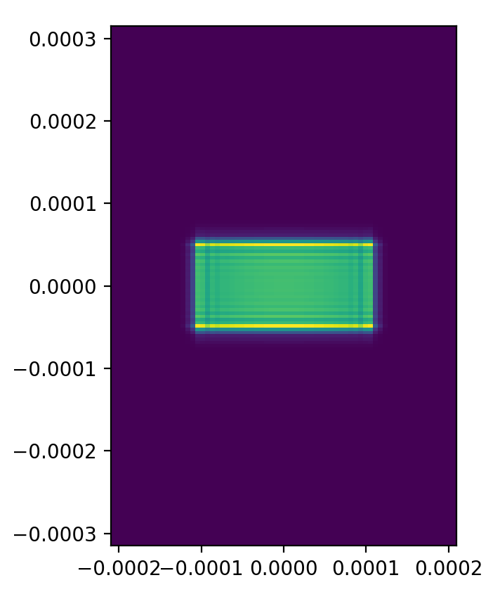

Purpose:
----
An attempt to integrate Sirepo/SRW simulations with Bluesky/Ophyd.

Based on this [Sirepo simulation](https://beta.sirepo.com/srw#/beamline/6JLvWbzP).


Prepare local Sirepo server:
----
- install Sirepo using Vagrant/VirtualBox following the [instructions](https://github.com/radiasoft/sirepo/wiki/Development)
  (you will need to install [VirtualBox](https://www.virtualbox.org/) and 
  [Vagrant](https://www.vagrantup.com/))
- after the successful installation start the VM with `vagrant up` and ssh to
  it with `vagrant ssh`
- run the following command to start Sirepo with the Bluesky interface (`bluesky` is a "secret" key used on both server and client sides, and the `SIREPO_FEATURE_CONFIG_SIM_TYPES=srw` part is optional if you run Sirepo directly on a Linux/Mac machine and only have SRW installed):
```
SIREPO_FEATURE_CONFIG_SIM_TYPES=srw SIREPO_AUTH_METHODS=bluesky:guest SIREPO_AUTH_BLUESKY_SECRET=bluesky sirepo service http
```
- in your browser, go to http://10.10.10.10:8000/srw, click the ":cloud: Import"
  button in the right-upper corner and upload the [archive](https://github.com/mrakitin/sirepo_bluesky/blob/master/basic.zip)
  with the simulation stored in this repo
- you should be redirected to the address like http://10.10.10.10:8000/srw#/source/IKROlKfR
- grab the last 8 alphanumeric symbols (`IKROlKfR`), which represent a UID for
  the simulation we will be working with in the next section.


Prepare Bluesky and trigger a simulated Sirepo detector:
----
- (OPTIONAL) make sure you have [mongodb](https://docs.mongodb.com/manual/tutorial/install-mongodb-on-os-x/) installed and the service is running (see [local.yml](local.yml) for details)
- create conda environment:
```bash
git clone https://github.com/NSLS-II/sirepo-bluesky/
cd sirepo-bluesky/
conda create -n sirepo_bluesky python=3.6 -y
conda activate sirepo_bluesky
pip install -r requirements.txt
```
- edit the `sirepo_detector.py` file to update the UID used for Bluesky-submitted
  simulations
- start ipython and run the following:
```ipython
%run -i re_config.py
%run -i sirepo_detector.py
```

In the interactive input prompt enter the following:
```
In [5]: %run -i sirepo_detector.py
Tunable parameters for Bluesky scan:
OPTICAL ELEMENT:    Aperture
PARAMETERS:        ['verticalOffset', 'horizontalSize', 'title', 'verticalSize', 'horizontalOffset', 'shape', 'position', 'type', 'id']

OPTICAL ELEMENT:    Watchpoint
PARAMETERS:        ['position', 'type', 'id', 'title']

WATCHPOINTS:       {'Watchpoint': '21'}
Please select optical element: Aperture
Please select watchpoint: Watchpoint
Please select parameter: horizontalSize
Please select another parameter or press ENTER to only use one: verticalSize
```

You should get something like:


- get the data:
```py
hdr = db[-1]
imgs = list(hdr.data('sirepo_det_image'))
cfg = hdr.config_data('sirepo_det')['primary'][0]
hor_ext = cfg['{}_horizontal_extent'.format(sirepo_det.name)]
vert_ext = cfg['{}_vertical_extent'.format(sirepo_det.name)]
plt.imshow(imgs[31], aspect='equal', extent=(*hor_ext, *vert_ext))
```
You should get something like:


